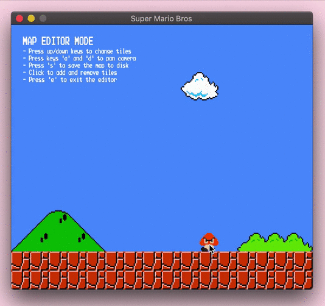

基本信息
======
课程名称：数据结构与算法   
课程类型：本科生必修课    
学时学分：48学时  
教学方式：课堂讲授+上机  
授课老师：周艳杰 [ieyjzhou@zzu.edu.cn](ieyjzhou@zzu.edu.cn)   
助教：张志程 [clarkzzzzz@foxmail.com](clarkzzzzz@foxmail.com)   
学生成绩评定方法：编程小作业30%，编程大作业20%，考试50%  

参考教材
======
[数据结构与算法书籍推荐](https://ieyjzhou.github.io/posts/2020/12/blog-post-5/)

编译器与IDE
======

1. Code::Blocks: a free C, C++ and Fortran IDE [download](http://www.codeblocks.org/downloads)
1. Dev-C++: A free, portable, fast and simple C/C++ IDE [download from sourceforge](https://sourceforge.net/projects/orwelldevcpp/) [download from github](https://github.com/Embarcadero/Dev-Cpp/releases)
1. [Visual Studio](https://visualstudio.microsoft.com/zh-hans/)
1. [GCC](https://gcc.gnu.org/) 

编程小作业 
======

**郑州大学ACM-ICPC创新实验室在线评测系统**  [http://acm.zzu.edu.cn/](http://acm.zzu.edu.cn/)

| 编程作业测试平台：     | 第二章：线性表|
| ----------- | ----------- |
| 1. [1007: C语言-最大值2](http://acm.zzu.edu.cn/problem.php?id=1007) | 1. [1075: 冒泡排序计数](http://acm.zzu.edu.cn/problem.php?id=1075)    |
| 2. [1014: C语言-数列求和](http://acm.zzu.edu.cn/problem.php?id=1014) | 2. [1095: 字符串反转](http://acm.zzu.edu.cn/problem.php?id=1095)  |
| 3. [1036: C语言-字符统计2](http://acm.zzu.edu.cn/problem.php?id=1036) | 3. [1199: 集装箱装载](http://acm.zzu.edu.cn/problem.php?id=1199)    |
| 4. [1056: A+B问题](http://acm.zzu.edu.cn/problem.php?id=1056) | 4. [1206: 装箱问题](http://acm.zzu.edu.cn/problem.php?id=1206)    |
| 5. [1047: C语言-数字调序](http://acm.zzu.edu.cn/problem.php?id=1047)    | 5. [4465: 帮学长起队名](http://acm.zzu.edu.cn/problem.php?id=4465)       |

| 第三章：栈与队列     | 第四章：树与二叉树|
| ----------- | ----------- |
| 1. [1133: 火车出站](http://acm.zzu.edu.cn/problem.php?id=1133) | 1. [1292: dfs](http://acm.zzu.edu.cn/problem.php?id=1292) | 
| 2. [1234: 机器翻译](http://acm.zzu.edu.cn/problem.php?id=1234) | 2. [1212: 搜城探宝](http://acm.zzu.edu.cn/problem.php?id=1212) | 
| 3. [1026: C语言-插入队列](http://acm.zzu.edu.cn/problem.php?id=1026) | 3. [1296: 中、后序遍历求前序遍历](http://acm.zzu.edu.cn/problem.php?id=1296) | 
| 4. [4401: 军训站队](http://acm.zzu.edu.cn/problem.php?id=4401) | 4. [1134: 复原二叉树](http://acm.zzu.edu.cn/problem.php?id=1219) | 
| 5. [1222: 后缀表达式求值](http://acm.zzu.edu.cn/problem.php?id=1222) | 5. [1134: 复原二叉树](http://acm.zzu.edu.cn/problem.php?id=4417)  |  

|  第五章：图     | 第六章：查找与排序|
| ----------- | ----------- |
| 1. [1190: 最短路](http://acm.zzu.edu.cn/problem.php?id=1190)| 1. [1044: 排序](http://acm.zzu.edu.cn/problem.php?id=1044)| 
| 2. [1156: 建设电力系统](http://acm.zzu.edu.cn/problem.php?id=1156)| 2. [1051: 成绩排序](http://acm.zzu.edu.cn/problem.php?id=1051)| 
| 3. [1154: 仓库的位置](http://acm.zzu.edu.cn/problem.php?id=1154)| 3. [1135: 赌徒](http://acm.zzu.edu.cn/problem.php?id=1135)| 
| 4. [1296: 中、后序遍历求前序遍历](http://acm.zzu.edu.cn/problem.php?id=1296)| 4. [1221: 查找细胞](http://acm.zzu.edu.cn/problem.php?id=1221)| 
| 5. [1488: 景区路线规划](http://acm.zzu.edu.cn/problem.php?id=1488)| 5. [1269: 排队打水问题](http://acm.zzu.edu.cn/problem.php?id=1269)| 

 

编程大作业:
======

## 使用 Branch and bound 实现 Kim and Hong (2006)论文中的 section 2求解
参考文献：
1. Kim, K. H., & Hong, G. P. (2006). A heuristic rule for relocating blocks. Computers & Operations Research, 33(4), 940-954.

测试集：
1. Test data set ([download link](https://sites.google.com/site/shunjitanaka/brp))

## 分别实现 Brucker (1984)和Balas and Zemel (1980)中描述的0-1背包问题求解算法  (小组作业，每组不超过6人)
参考文献：
1. Martello, S. (1990). Knapsack problems: algorithms and computer implementations. Wiley-Interscience series in discrete mathematics and optimiza tion.
2. Brucker, P. (1984). An O (n) algorithm for quadratic knapsack problems. Operations Research Letters, 3(3), 163-166.
3. Balas, E., & Zemel, E. (1980). An algorithm for large zero-one knapsack problems. Operations Research, 28(5), 1130-1154.

测试集：
1. Test data set ([download link](https://people.sc.fsu.edu/~jburkardt/datasets/knapsack_01/knapsack_01.html))

## 超级玛丽源代码分析 Super Mario project source analysis (小组作业，每组不超过6人)
参考文献：
 1. Writing Super Mario Bros in C++ [medium link](https://feresr.medium.com/writing-super-mario-bros-in-c-e59dfc5743af),[dev link](https://dev.to/feresr/writing-super-mario-bros-in-c-4726)  

源代码：
 1. [code download](https://github.com/ieyjzhou/super-mario-bros)  

| 主题       |  主题 |
| ----------- | ----------- |
|     地图存储   |  框架分析 |
|     .......   |  ....... |



